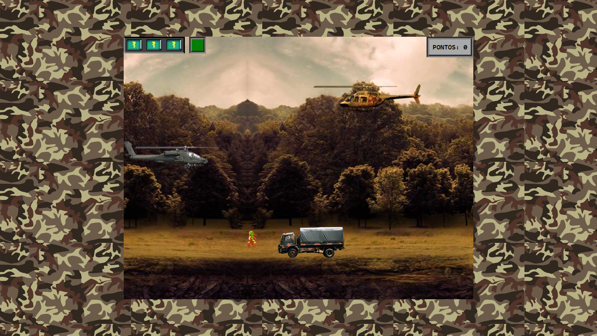

#MRV-Jogo Helicoptero

Este simples jogo foi feito com HTML, CSS e JavaScript (puro). Os recursos audiovisuais vieram do BootCamp da MRV em parceria com a DIO.

Decidi não utilizar o jQuery por estar caindo em desuso e para poder aprofundar melhor minhas habilidades com JavaScript puro. Assim sendo, tomei a liberdade para desviar um pouco das aulas e criar uma versão modificada do jogo.

##
